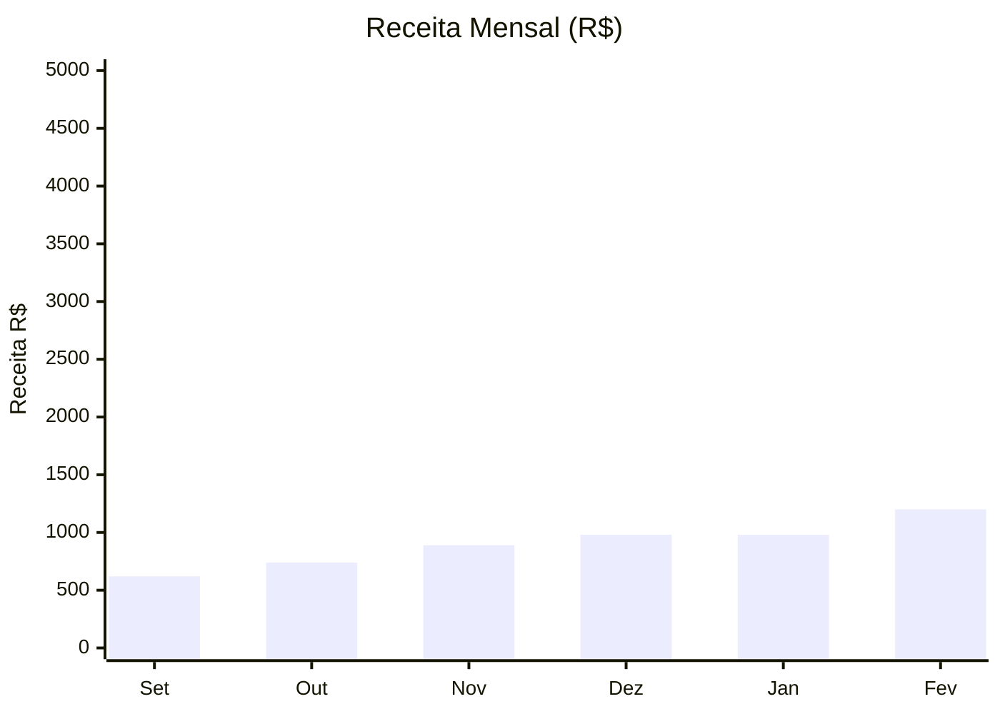
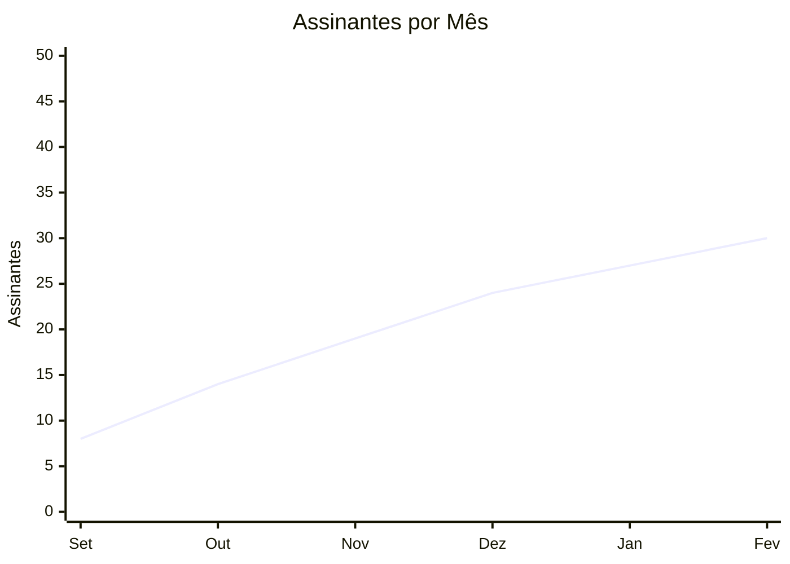
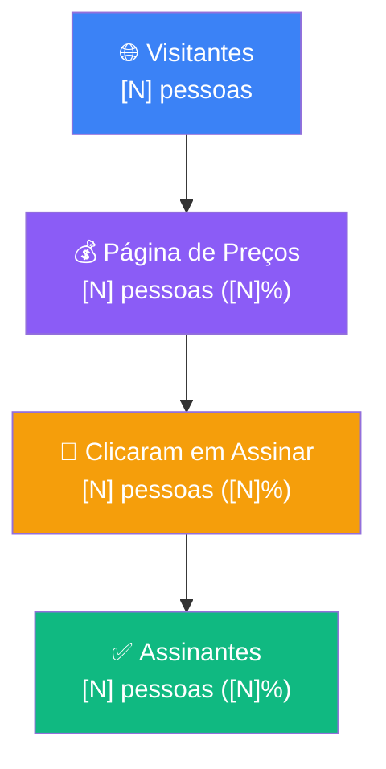

# Canvaviagem Relatório Visual

Esta skill recebe dados das skills `canvaviagem_dados_stripe` e `canvaviagem_dados_analytics` e os transforma em um relatório visual completo — com gráficos de barras em texto, funil visual, tabelas comparativas e diagramas Mermaid quando necessário.

## Para Que Serve

Números soltos não dizem nada. Esta skill organiza os dados em uma apresentação visual que permite ao Lucas entender o negócio em 30 segundos: o que cresceu, o que caiu, onde está o gargalo, e o que fazer a seguir.

## Sequência de Execução

Esta skill SEMPRE segue este fluxo antes de gerar qualquer relatório:

1. Acionar `canvaviagem_dados_stripe` → obter dados de assinantes e receita
2. Acionar `canvaviagem_dados_analytics` → obter dados de tráfego e comportamento
3. Cruzar os dados das duas fontes
4. Gerar o relatório visual completo

## Tipos de Relatório

### RELATÓRIO DIÁRIO (30 segundos para ler)

```
╔══════════════════════════════════════════════════════╗
║      CANVA VIAGEM — STATUS DO DIA  [DD/MM/YYYY]     ║
╚══════════════════════════════════════════════════════╝

  Assinantes ativos:   [N]     (▲+[N] hoje)
  Faturamento do mês:  R$[N]   (meta: R$30.000)
  Progresso da meta:   [████████░░░░░░░]  [N]%

  Hoje:
  • [N] visitantes no site
  • [N] foram à página de preços
  • [N] clicaram no checkout
  • [N] assinaram

  ⚠️  Atenção: [alerta se algo estiver fora do normal]
  ✅  Destaque: [o melhor número do dia]
```

### RELATÓRIO SEMANAL (7 dias)

```
╔══════════════════════════════════════════════════════════════╗
║         CANVA VIAGEM — RELATÓRIO SEMANAL                    ║
║         [DATA INICIAL] → [DATA FINAL]                       ║
╚══════════════════════════════════════════════════════════════╝

━━━ ASSINANTES ━━━━━━━━━━━━━━━━━━━━━━━━━━━━━━━━━━━━━━━━━━━━━
  Ativos agora:        [N]
  Novos na semana:     [N]     ▲ [%] vs semana anterior
  Cancelamentos:       [N]
  Saldo líquido:       [+N ou -N]

━━━ RECEITA ━━━━━━━━━━━━━━━━━━━━━━━━━━━━━━━━━━━━━━━━━━━━━━━━
  MRR:                 R$ [N]
  Faturamento mês:     R$ [N]   / Meta R$30.000
  Progresso:           [██████████░░░░░░░░░░]  [N]%

━━━ TRÁFEGO (últimos 7 dias) ━━━━━━━━━━━━━━━━━━━━━━━━━━━━━━━

  Acessos por dia:
  Seg  [██████████████░░░░]  [N]
  Ter  [███████████░░░░░░░]  [N]
  Qua  [████████████░░░░░░]  [N]
  Qui  [███████████░░░░░░░]  [N]
  Sex  [████████░░░░░░░░░░]  [N]
  Sab  [██████░░░░░░░░░░░░]  [N]
  Dom  [████░░░░░░░░░░░░░░]  [N]
  ─────────────────────────────────────
  Total:  [N] visitas

━━━ FUNIL DE CONVERSÃO ━━━━━━━━━━━━━━━━━━━━━━━━━━━━━━━━━━━━━

  [N] Visitantes totais
       │ [N]% foram à página de preços
       ▼
  [N] Visitaram /planos
       │ [N]% clicaram no checkout
       ▼
  [N] Clicaram em Assinar
       │ [N]% concluíram
       ▼
  [N] Novos assinantes
  ─────────────────────────────────────
  Conversão geral: [visitantes→assinantes] = [N]%

━━━ FONTES DE TRÁFEGO ━━━━━━━━━━━━━━━━━━━━━━━━━━━━━━━━━━━━━━

  Instagram    [████████████░░░░░]  [N] visitas  [N]%
  Google       [███████░░░░░░░░░░]  [N] visitas  [N]%
  Direto       [█████░░░░░░░░░░░░]  [N] visitas  [N]%
  TikTok       [███░░░░░░░░░░░░░░]  [N] visitas  [N]%
  Outros       [██░░░░░░░░░░░░░░░]  [N] visitas  [N]%

━━━ SAÚDE DO NEGÓCIO ━━━━━━━━━━━━━━━━━━━━━━━━━━━━━━━━━━━━━━━

  Churn rate:          [N]%    (ideal: abaixo de 5%)
  Ticket médio:        R$ [N]
  LTV estimado:        R$ [N]
  Crescimento MoM:     [N]%

━━━ AÇÕES SUGERIDAS ━━━━━━━━━━━━━━━━━━━━━━━━━━━━━━━━━━━━━━━━

  1. [ação baseada no maior gargalo do funil]
  2. [ação baseada na fonte de tráfego com melhor conversão]
  3. [ação baseada em churn se acima de 5%]

╚══════════════════════════════════════════════════════════════╝
```

### RELATÓRIO MENSAL COMPLETO (com Mermaid)

Para relatório completo com diagrama de funil visual:

**Diagrama de Funil (Mermaid):**


**Evolução de Receita (Mermaid):**


**Crescimento de Assinantes (Mermaid):**


**Funil de Conversão (Mermaid):**


## Como Gerar o Gráfico de Barras em Texto

Função para converter dado numérico em barra visual:

```
Dado: valor = 142, máximo = 200, largura = 18 blocos
Blocos preenchidos = round(142/200 * 18) = 13
Barra = "█████████████░░░░░"  (13 cheios + 5 vazios)
```

Sempre mostrar o número real ao lado da barra.

## Alertas Automáticos

O relatório deve incluir alertas se:
- Churn > 5%: "⚠️ Churn acima do ideal. Verificar motivos de cancelamento."
- Conversão /planos < 2%: "⚠️ Página de preços com baixa conversão. Revisar copy ou oferta."
- Novos assinantes na semana = 0: "🔴 Nenhuma nova assinatura esta semana. Verificar tráfego e funil."
- Crescimento < 0%: "⚠️ MRR caiu vs mês anterior. Churn supera novas assinaturas."
- Tráfego semanal < 100 visitas: "⚠️ Volume de tráfego baixo. Intensificar postagens orgânicas."

## Destaques Automáticos

O relatório deve incluir destaques se:
- Maior dia de tráfego da semana: destacar qual dia e correlacionar com conteúdo postado
- Fonte com melhor conversão: destacar e sugerir dobrar o esforço nessa fonte
- Crescimento acima de 10%: "✅ Ótimo crescimento! Identificar o que funcionou e replicar."

## Quando Usar Cada Tipo de Relatório

**Diário:** Chamar toda manhã para ter o pulso do negócio.
**Semanal:** Segunda-feira para planejar a semana com base nos dados da anterior.
**Mensal:** Primeiro dia do mês para revisão completa e planejamento.

## Contexto de Meta

Sempre incluir no relatório o progresso em relação às metas:
- Meta atual: R$30.000/mês (6 meses)
- Meta longo prazo: R$100.000/mês (12 meses)
- Para chegar em R$30.000: precisa de ~1.035 assinantes a R$29/mês OU mix de planos mensais e anuais

Incluir linha de tendência: "No ritmo atual, o faturamento de R$30.000/mês será atingido em [estimativa baseada no crescimento % atual]."
